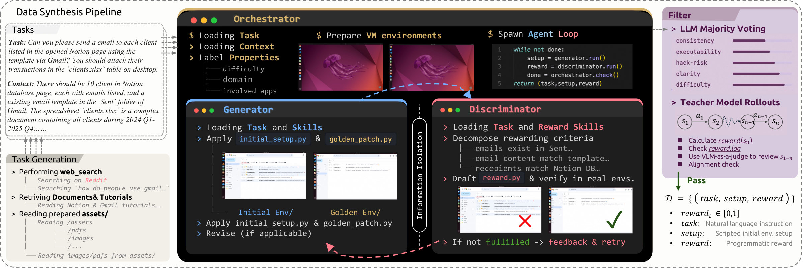
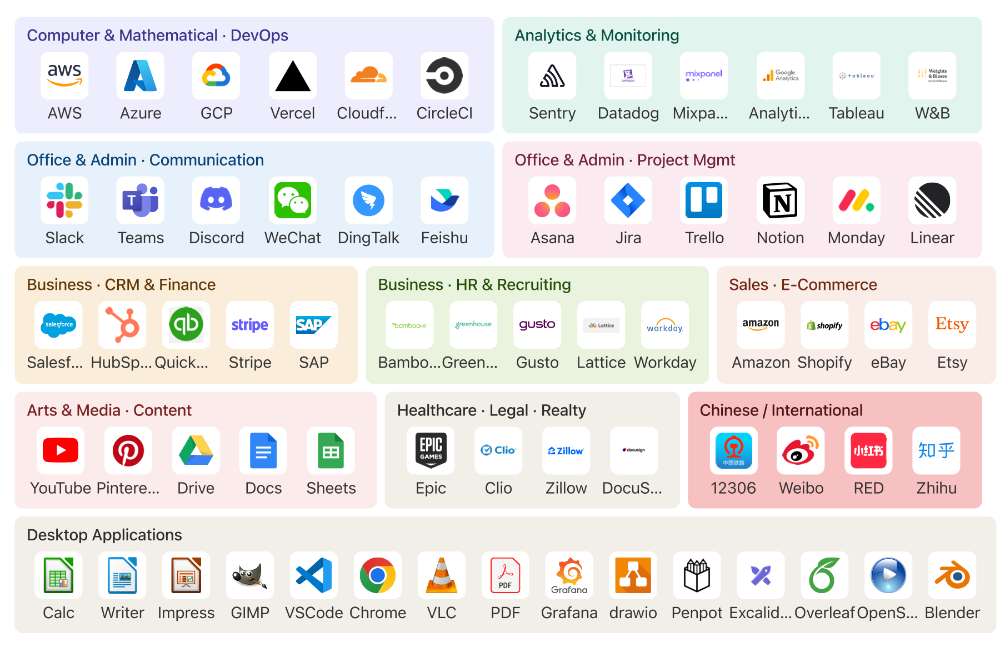
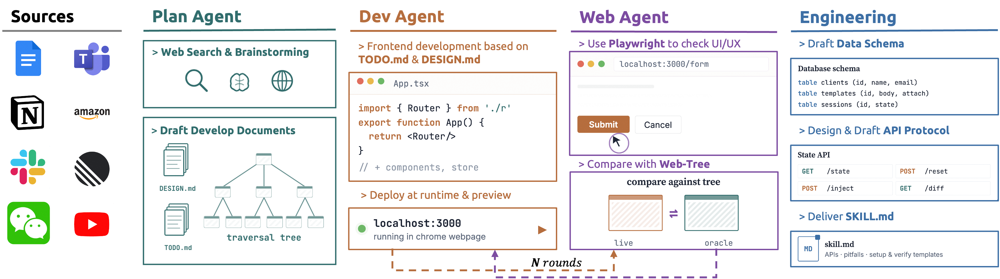

# CUA-Gym: Scaling Verifiable Training Environments and Tasks for Computer-Use Agents

<p align="center">
  <a href="https://arxiv.org/abs/XXXX.XXXXX">📄 Paper</a> |
  <a href="https://huggingface.co/datasets/xlangai/CUA-Gym">🤗 Dataset</a> |
  <a href="https://huggingface.co/datasets/xlangai/CUA-Gym/viewer/tasks/train">🔎 Data Viewer</a> |
  <a href="https://huggingface.co/collections/xlangai/cua-gym">🤖 Models</a> |
  <a href="https://github.com/BowenBryanWang/CUA-Gym-Hub">🧩 CUA-Gym-Hub</a>
</p>

<div align="center">

[](https://arxiv.org/abs/XXXX.XXXXX)
[](https://huggingface.co/datasets/xlangai/CUA-Gym)
[](https://huggingface.co/collections/xlangai/cua-gym)
[](LICENSE)
[](https://www.python.org/)

</div>

CUA-Gym is a scalable pipeline for synthesizing verifiable RLVR training data for computer-use agents (CUAs). Given a topic, it jointly produces task instructions, environment states, and reward functions as verified triples — using coding agents to handle the engineering work previously requiring human experts.

<p align="center">
  
</p>

## 📣 Updates

- **2026-05-14:** We release the full pipeline, dataset and models of CUA-Gym 🔥🔥🔥

## About

Training computer-use agents with reinforcement learning requires a consistent triple of **(task instruction, executable environment, verifiable reward)**. Hand-authoring even one such triple takes hours; CUA-Gym automates this at scale.

**Pipeline.** Three coordinated agents run per task:

- **Generator** (`setup-gen`): constructs the initial and golden environment states (`initial_setup.py`, `golden_patch.py`)
- **Discriminator** (`reward-gen`): writes `reward.py` from the task description alone, without access to Generator's code (information barrier)
- **Orchestrator**: drives the two through iterative rounds until `reward(golden)=1.0` and `reward(initial)=0.0` both hold under execution

**Filtering.** Verified tuples pass through an LLM majority-vote filter (`filter/majority_vote_filter.py`) that rejects tasks where the reward is fragile, ambiguous, or inconsistent. Teacher rollouts provide a second filter stage.

**Environments.** CUA-Gym covers 110 environments: 16 desktop applications and 94 synthesized mock web applications grounded in real-world software-use distributions.

**Dataset.** The resulting [CUA-Gym dataset](https://huggingface.co/datasets/xlangai/CUA-Gym) contains **32,112** verified RLVR training tuples.

**Comparison with existing CUA RLVR datasets:**

<div align="center">

| Dataset | Platform | Data size | Env. size | Reward | Open |
|---------|----------|----------:|----------:|--------|:----:|
| GUI-Genesis | Mobile | 969 | 1 | Programmatic | No |
| WebArena-Infinity | Web | 1,260 | 10 | Programmatic | Yes |
| InfiniteWeb | Web | 600 | — | Programmatic | No★ |
| UltraCUA | Desktop | 17,000 | 9 | Programmatic | No★ |
| Gym-Anything | Desktop | 7,277 | 193 | VLM | Yes |
| **CUA-Gym** | **Desktop + Web** | **32,122** | **110** | **Programmatic** | **Yes** |

</div>

★ partial release.

## Results

CUA-Gym improves computer-use agents through verifiable RL training over both desktop and web environments. We evaluate trained models on [OSWorld-Verified](https://os-world.github.io/) and [WebArena](https://webarena.dev/), covering realistic multi-step software and browser tasks. CUA-Gym models deliver strong gains over their base models, with the A17B model setting a new open-source state-of-the-art on both benchmarks.

<div align="center">

| Model | OSWorld-Verified | WebArena |
|-------|:----------------:|:--------:|
| *Claude Sonnet 4.6* | 72.9 | 65.6 |
| *Claude Opus 4.7* | 78.0 | — |
| *GPT-5.5* | 78.7 | — |
| *EvoCUA-8B* | 46.1 | — |
| *EvoCUA-32B* | 56.7 | — |
| *Kimi-K2.6* | 73.1 | — |
| Qwen3.5-35B-A3B (base) | 54.5 | 40.8 |
| Qwen3.5-397B-A17B (base) | 62.2 | 54.0 |
| **CUA-Gym-A3B** | **62.1** | **44.5** |
| **CUA-Gym-A17B** | **70.2** | **56.0** |

</div>

Both models set state-of-the-art among open-source CUAs at their respective scales. CUA-Gym-A3B matches the much larger A17B base at ~10× fewer active parameters.

## Getting Started

**Install**

```bash
git clone https://github.com/BowenBryanWang/CUA-Gym
cd CUA-Gym
pip install -e ".[dev]"
cp .env.example .env  # fill in OPENAI_API_KEY and ALIYUN_* credentials
```

**Generate tasks for a domain**

Invoke the `task-gen` agent from the CUA-Gym directory in Claude Code:

```
Generate 50 LibreOffice Calc tasks covering formatting and formula operations.
```

Output: `output/task_generation/<topic>.json`

**Run the adversarial co-generation loop**

```bash
python scripts/batch_orchestrator.py output/task_generation/calc_formatting.json
```

Verified tuples land in `output/final/<task_id>/`.

**Run the majority-vote filter**

```bash
export OPENAI_API_KEY=sk-...
python filter/majority_vote_filter.py \
  --tasks-dir output/final \
  --votes 3 \
  --model gpt-4o \
  --write
```

**Download the pre-built dataset**

```bash
huggingface-cli download xlangai/CUA-Gym --repo-type dataset --local-dir data/
```

## Supported Environments

<p align="center">
  
</p>

## CUA-Gym-Hub

[CUA-Gym-Hub](https://github.com/BowenBryanWang/CUA-Gym-Hub) is the environment layer of CUA-Gym: a suite of self-contained mock web applications designed for scalable RL training. Each environment looks and behaves like a realistic web product, while exposing a unified state API for deterministic reset, inspection, mutation, and reward verification.

<p align="center">
  
</p>

CUA-Gym-Hub is built by a multi-agent environment synthesis pipeline. Given a target application seed, the system drafts the product specification, implements the mock web app, exercises the UI with Playwright, and iterates until the live interface and API protocol match the specification.

**What CUA-Gym-Hub provides:**

- **Realistic mock applications:** browser environments spanning productivity, communication, development, commerce, finance, analytics, and media workflows.
- **Unified state API:** every mock supports programmatic state injection, reset, retrieval, and diffing through a consistent HTTP interface.
- **Verifiable rewards:** task-specific reward functions can inspect environment state directly instead of relying on screenshots or manual labels.
- **Drop-in task generation:** generated apps plug into the CUA-Gym task synthesis pipeline as reproducible training environments.

**Run a mock app locally**

```bash
cd hub/notion_mock && npm install && npm run dev
```

**Inspect environment state**

```bash
curl http://localhost:5173/api/state
```

See [hub/README.md](hub/README.md) for the full environment list, API contract, and app-specific setup instructions.

## CUA-Gym Datasets

CUA-Gym releases executable RLVR task bundles for computer-use agents. Each row in the Hugging Face [Dataset Viewer](https://huggingface.co/datasets/xlangai/CUA-Gym/viewer/tasks/train) is a task-level index entry: it contains the natural-language instruction, environment metadata, setup references, and reward-function reference needed to reconstruct the original task bundle.

👉 [CUA-Gym Hugging Face Dataset](https://huggingface.co/datasets/xlangai/CUA-Gym)

Install the standard Hugging Face dataset tooling:

```bash
pip install -U datasets huggingface_hub
```

Load the task index directly in Python:

```python
from datasets import load_dataset

tasks = load_dataset("xlangai/CUA-Gym", split="train")
example = tasks[0]

print(example["instruction"])
print(example["app_type"], example["platform"], example["setup_kind"])
```

Or download the full dataset repository locally:

```bash
huggingface-cli download xlangai/CUA-Gym \
  --repo-type dataset \
  --local-dir ./CUA-Gym-data
```

The dataset is organized around one viewer-friendly table plus executable artifacts:

```
data/
  tasks.parquet
artifacts/
  cua_gym_tasks_v1.tar.zst
```

Each task bundle contains:

```
<task_id>/
  task.json
  reward.py
  initial_setup.py | initial_setup.sh | initial_setup.xlsx | initial_setup.docx | initial_setup.pptx
```

To execute a task, extract the artifact archive, read `<task_id>/task.json`, run the listed setup steps in the target environment, let the agent interact with the environment, and finally run `<task_id>/reward.py` to compute the programmatic score.

## Citation

```bibtex
@article{cuagym2026,
  title   = {CUA-Gym: Scaling Verifiable Training Environments and Tasks for Computer-Use Agents},
  author  = {},
  journal = {arXiv preprint arXiv:XXXX.XXXXX},
  year    = {2026}
}
```

## License

Code: [Apache 2.0](LICENSE) · Dataset: [CC BY 4.0](https://creativecommons.org/licenses/by/4.0/)
